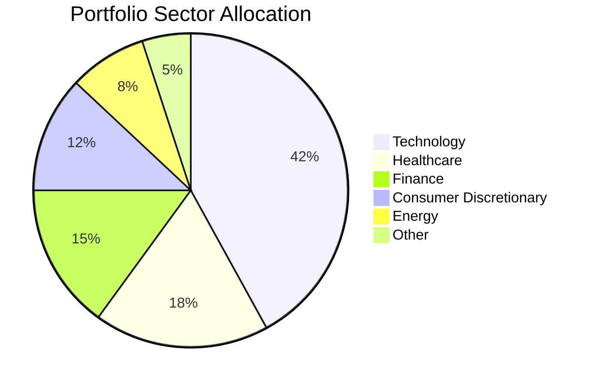
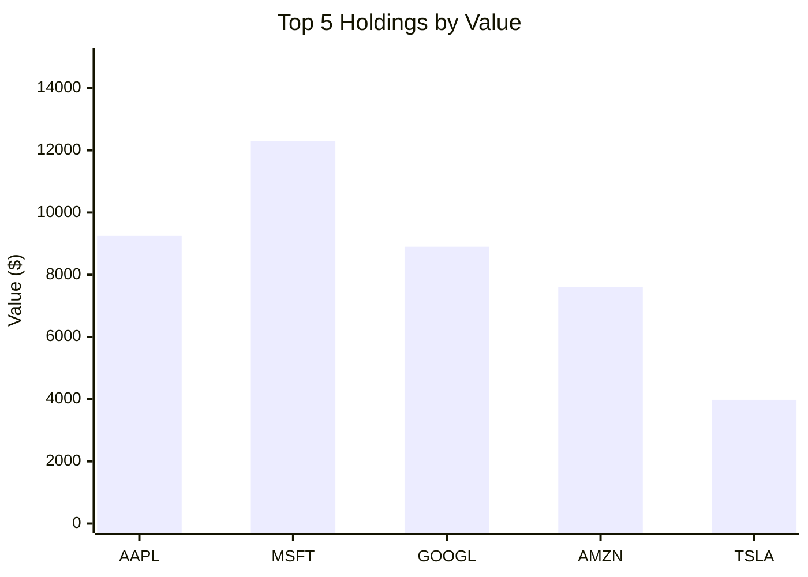
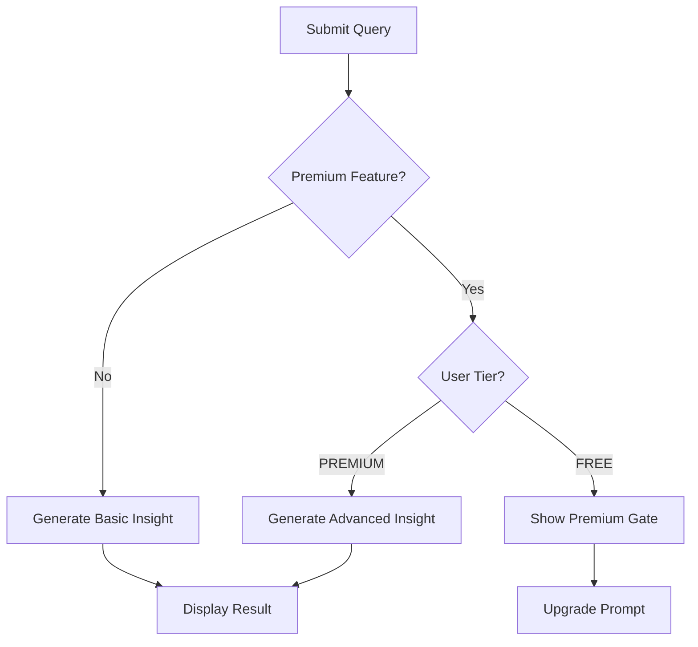

# Acuity Invest — UX Design Specification

> **Version:** 1.0.0
> **Last Updated:** 2026-02-14
> **Author:** UX Research Team
> **Status:** Approved for Development
> **Audience:** Frontend Engineers, QA Engineers, Product Managers

---

## Table of Contents

1. [Design System & ING Brand Alignment](#1-design-system--ing-brand-alignment)
2. [Page Layout & Information Architecture](#2-page-layout--information-architecture)
3. [User Flows & Interaction Patterns](#3-user-flows--interaction-patterns)
4. [Component Inventory](#4-component-inventory)
5. [Responsive Design Strategy](#5-responsive-design-strategy)
6. [Accessibility (a11y) Requirements](#6-accessibility-a11y-requirements)
7. [Micro-interactions & Animation](#7-micro-interactions--animation)
8. [Data Visualization Guidelines](#8-data-visualization-guidelines)

---

## 1. Design System & ING Brand Alignment

### 1.1 Design Philosophy

Acuity Invest follows ING's design principles: **clear, easy, and forward-looking**. Every design decision prioritizes clarity of financial information, ease of interaction, and a modern aesthetic that conveys trust and intelligence. The AI-powered nature of the platform should feel approachable, not intimidating.

**Core Principles:**

- **Clarity First** — Financial data must be immediately scannable. No decorative elements that compete with numbers.
- **Confident Simplicity** — The interface should feel like a knowledgeable advisor: calm, organized, direct.
- **Progressive Disclosure** — Show summary first, details on demand. Never overwhelm.
- **Visual Hierarchy Through Data** — Let the data itself (color-coded gains/losses, chart proportions) tell the story before the user reads labels.

---

### 1.2 Color Palette

#### Primary Colors

| Token Name | Hex | RGB | Usage |
|---|---|---|---|
| `--color-primary` | `#FF6200` | `rgb(255, 98, 0)` | Primary brand color, CTAs, active states, key accent |
| `--color-primary-hover` | `#E65800` | `rgb(230, 88, 0)` | Hover state for primary interactive elements |
| `--color-primary-active` | `#CC4E00` | `rgb(204, 78, 0)` | Active/pressed state for primary elements |
| `--color-primary-light` | `#FFF0E6` | `rgb(255, 240, 230)` | Primary tint for backgrounds, badges, subtle highlights |
| `--color-primary-muted` | `#FFB380` | `rgb(255, 179, 128)` | Muted orange for secondary accents, chart fills |

#### Semantic Colors — Financial

| Token Name | Hex | RGB | Usage |
|---|---|---|---|
| `--color-positive` | `#00875A` | `rgb(0, 135, 90)` | Gains, positive performance, upward trends |
| `--color-positive-light` | `#E6F5EE` | `rgb(230, 245, 238)` | Positive background tint (e.g., gain cell bg) |
| `--color-positive-hover` | `#006B47` | `rgb(0, 107, 71)` | Hover state for positive elements |
| `--color-negative` | `#DE350B` | `rgb(222, 53, 11)` | Losses, negative performance, downward trends |
| `--color-negative-light` | `#FFEBE6` | `rgb(255, 235, 230)` | Negative background tint (e.g., loss cell bg) |
| `--color-negative-hover` | `#BF2600` | `rgb(191, 38, 0)` | Hover state for negative elements |
| `--color-neutral` | `#6B778C` | `rgb(107, 119, 140)` | Neutral/unchanged values, zero-delta states |
| `--color-neutral-light` | `#F4F5F7` | `rgb(244, 245, 247)` | Neutral background tint |

> **IMPORTANT:** The green (`#00875A`) and red (`#DE350B`) values have been selected to meet WCAG AA contrast requirements against white backgrounds (4.5:1 minimum). Do NOT substitute these with brighter/lighter variants without verifying contrast ratios.

#### Neutral / Gray Scale

| Token Name | Hex | Usage |
|---|---|---|
| `--color-gray-900` | `#1A1A2E` | Primary text, headings |
| `--color-gray-800` | `#2D2D44` | Secondary headings, emphasis text |
| `--color-gray-700` | `#42526E` | Body text |
| `--color-gray-600` | `#5E6C84` | Secondary body text |
| `--color-gray-500` | `#6B778C` | Placeholder text, disabled text |
| `--color-gray-400` | `#97A0AF` | Tertiary text, timestamps |
| `--color-gray-300` | `#C1C7D0` | Borders, dividers |
| `--color-gray-200` | `#DFE1E6` | Subtle borders, table row dividers |
| `--color-gray-100` | `#EBECF0` | Background surfaces (cards on gray bg) |
| `--color-gray-50` | `#F4F5F7` | Page background, alternate table rows |

#### Background & Surface Colors

| Token Name | Hex | Usage |
|---|---|---|
| `--color-bg-primary` | `#FFFFFF` | Main content background |
| `--color-bg-secondary` | `#F7F8FA` | Page background, sidebar background |
| `--color-bg-tertiary` | `#EBECF0` | Inset areas, code blocks, scratchpad bg |
| `--color-bg-elevated` | `#FFFFFF` | Cards, modals, popovers (distinguished by shadow) |
| `--color-bg-overlay` | `rgba(9, 30, 66, 0.54)` | Modal/dialog backdrop overlay |
| `--color-bg-insight` | `#FAFBFC` | AI insight display background |

#### Subscription Tier Colors

| Token Name | Hex | Usage |
|---|---|---|
| `--color-tier-free` | `#6B778C` | FREE badge, free tier indicators |
| `--color-tier-free-bg` | `#F4F5F7` | FREE badge background |
| `--color-tier-premium` | `#FF6200` | PREMIUM badge, premium tier indicators |
| `--color-tier-premium-bg` | `#FFF0E6` | PREMIUM badge background |

---

### 1.3 Typography

#### Font Families

```css
/* UI Text — Headers, body, labels, buttons */
--font-family-ui: 'Inter', -apple-system, BlinkMacSystemFont, 'Segoe UI', Roboto, sans-serif;

/* Display Text — Large dashboard numbers, hero metrics */
--font-family-display: 'DM Sans', 'Inter', sans-serif;

/* Financial Data — Prices, quantities, percentages, table numbers */
--font-family-mono: 'JetBrains Mono', 'Fira Code', 'SF Mono', 'Consolas', monospace;

/* Insight Content — AI-generated markdown text */
--font-family-insight: 'Inter', sans-serif;
```

**Loading Strategy:** Load Inter (weights 400, 500, 600, 700), DM Sans (weights 500, 700), and JetBrains Mono (weights 400, 500) via Google Fonts or self-hosted WOFF2 files. Use `font-display: swap` to prevent FOIT.

#### Type Scale

| Token | Size (px) | Size (rem) | Line Height | Weight | Usage |
|---|---|---|---|---|---|
| `--text-display-xl` | 40 | 2.5 | 1.1 | 700 (DM Sans) | Portfolio total value (hero) |
| `--text-display-lg` | 32 | 2.0 | 1.15 | 700 (DM Sans) | Section hero numbers |
| `--text-display-md` | 24 | 1.5 | 1.2 | 700 (DM Sans) | Metric card primary values |
| `--text-heading-xl` | 28 | 1.75 | 1.25 | 700 | Page titles |
| `--text-heading-lg` | 22 | 1.375 | 1.3 | 600 | Section headings |
| `--text-heading-md` | 18 | 1.125 | 1.35 | 600 | Card titles, subsection headings |
| `--text-heading-sm` | 16 | 1.0 | 1.4 | 600 | Small headings, table headers |
| `--text-body-lg` | 16 | 1.0 | 1.6 | 400 | Primary body text, insight text |
| `--text-body-md` | 14 | 0.875 | 1.5 | 400 | Standard body text, table cells |
| `--text-body-sm` | 13 | 0.8125 | 1.45 | 400 | Secondary text, helper text |
| `--text-caption` | 12 | 0.75 | 1.4 | 500 | Labels, badges, timestamps |
| `--text-overline` | 11 | 0.6875 | 1.4 | 600 | Overlines, uppercase labels |
| `--text-mono-lg` | 18 | 1.125 | 1.3 | 500 (JetBrains) | Large financial numbers |
| `--text-mono-md` | 14 | 0.875 | 1.4 | 400 (JetBrains) | Table financial data |
| `--text-mono-sm` | 12 | 0.75 | 1.35 | 400 (JetBrains) | Inline financial data |

#### Typography Rules

1. **Financial numbers** always use `--font-family-mono`. This includes prices, percentages, portfolio values, share quantities, and any numeric data in tables.
2. **Headings** use `--font-family-ui` with semibold (600) or bold (700) weight.
3. **Hero metric values** (e.g., total portfolio value on the dashboard) use `--font-family-display` for visual impact.
4. **AI-generated insight text** uses `--font-family-ui` at `--text-body-lg` with `--color-gray-700`.
5. **ALL-CAPS text** is restricted to overline labels only (`--text-overline`). Add `letter-spacing: 0.08em` to uppercase text.
6. **Tabular numbers** — All number columns in tables must use `font-variant-numeric: tabular-nums` to ensure digit alignment.

---

### 1.4 Spacing System

Base unit: **4px**

| Token | Value | Usage |
|---|---|---|
| `--space-0` | 0px | Reset |
| `--space-1` | 4px | Tight inline spacing, icon-to-text gap |
| `--space-2` | 8px | Small gaps, compact padding |
| `--space-3` | 12px | Default inline spacing |
| `--space-4` | 16px | Standard padding, form field gaps |
| `--space-5` | 20px | Medium section gaps |
| `--space-6` | 24px | Card internal padding, standard section gap |
| `--space-8` | 32px | Large section gaps, card-to-card spacing |
| `--space-10` | 40px | Page section spacing |
| `--space-12` | 48px | Major layout sections |
| `--space-16` | 64px | Page top/bottom padding |
| `--space-20` | 80px | Hero section spacing |

#### Spacing Rules

- **Card internal padding:** `--space-6` (24px) on all sides.
- **Card-to-card gap:** `--space-6` (24px) in grid layouts.
- **Section-to-section gap:** `--space-10` (40px) vertically.
- **Form field vertical gap:** `--space-4` (16px).
- **Inline element gap (icon + text):** `--space-2` (8px).
- **Table cell padding:** `--space-3` (12px) horizontal, `--space-2` (8px) vertical.
- **Page horizontal padding (desktop):** `--space-8` (32px) on each side.
- **Page horizontal padding (mobile):** `--space-4` (16px) on each side.

---

### 1.5 Border Radius

| Token | Value | Usage |
|---|---|---|
| `--radius-none` | 0px | No rounding |
| `--radius-sm` | 4px | Small elements: badges, chips, inline tags |
| `--radius-md` | 8px | Standard elements: cards, inputs, buttons |
| `--radius-lg` | 12px | Prominent elements: modals, large cards |
| `--radius-xl` | 16px | Feature cards, hero containers |
| `--radius-full` | 9999px | Pills, avatars, circular buttons |

#### Border Rules

- **Cards:** `--radius-md` (8px).
- **Buttons:** `--radius-md` (8px).
- **Input fields:** `--radius-md` (8px).
- **Modals/Dialogs:** `--radius-lg` (12px).
- **Badges/Chips:** `--radius-full` (pill shape).
- **Tooltips:** `--radius-sm` (4px).

---

### 1.6 Shadows & Elevation

| Token | Value | Usage |
|---|---|---|
| `--shadow-none` | `none` | Flat elements |
| `--shadow-xs` | `0 1px 2px rgba(9, 30, 66, 0.08)` | Subtle lift: table rows on hover |
| `--shadow-sm` | `0 1px 3px rgba(9, 30, 66, 0.1), 0 1px 2px rgba(9, 30, 66, 0.06)` | Standard cards at rest |
| `--shadow-md` | `0 4px 8px rgba(9, 30, 66, 0.1), 0 2px 4px rgba(9, 30, 66, 0.06)` | Elevated cards, dropdowns |
| `--shadow-lg` | `0 8px 16px rgba(9, 30, 66, 0.12), 0 4px 8px rgba(9, 30, 66, 0.08)` | Modals, popovers |
| `--shadow-xl` | `0 16px 32px rgba(9, 30, 66, 0.15), 0 8px 16px rgba(9, 30, 66, 0.1)` | Full-screen overlays, premium gate |
| `--shadow-focus` | `0 0 0 3px rgba(255, 98, 0, 0.3)` | Focus ring for interactive elements |
| `--shadow-focus-inset` | `inset 0 0 0 2px #FF6200` | Inset focus ring for inputs |

#### Elevation Hierarchy

| Level | Shadow Token | z-index | Elements |
|---|---|---|---|
| 0 — Base | `--shadow-none` | `auto` | Page background, inline content |
| 1 — Raised | `--shadow-sm` | `auto` | Cards, form inputs |
| 2 — Elevated | `--shadow-md` | `10` | Dropdown menus, sticky headers |
| 3 — Overlay | `--shadow-lg` | `100` | Modals, dialogs, premium gate |
| 4 — Top | `--shadow-xl` | `200` | Toast notifications, critical overlays |

---

### 1.7 Component Tokens

#### Buttons

```
Primary Button:
  background:     --color-primary (#FF6200)
  color:          #FFFFFF
  border:         none
  padding:        12px 24px (--space-3 --space-6)
  border-radius:  --radius-md (8px)
  font:           --text-body-md, weight 600
  shadow:         --shadow-xs
  hover:
    background:   --color-primary-hover (#E65800)
    shadow:       --shadow-sm
  active:
    background:   --color-primary-active (#CC4E00)
    shadow:       --shadow-none
    transform:    translateY(1px)
  disabled:
    background:   --color-gray-200 (#DFE1E6)
    color:        --color-gray-400 (#97A0AF)
    cursor:       not-allowed
  focus:
    outline:      none
    box-shadow:   --shadow-focus

Secondary Button:
  background:     transparent
  color:          --color-primary (#FF6200)
  border:         1.5px solid --color-primary
  padding:        12px 24px
  border-radius:  --radius-md (8px)
  hover:
    background:   --color-primary-light (#FFF0E6)
  active:
    background:   --color-primary-muted (#FFB380)
    color:        #FFFFFF

Ghost Button:
  background:     transparent
  color:          --color-gray-700 (#42526E)
  border:         none
  hover:
    background:   --color-gray-50 (#F4F5F7)
  active:
    background:   --color-gray-100 (#EBECF0)

Danger Button:
  background:     --color-negative (#DE350B)
  color:          #FFFFFF
  hover:
    background:   --color-negative-hover (#BF2600)

Button Sizes:
  sm:   padding 8px 16px,  font --text-body-sm (13px)
  md:   padding 12px 24px, font --text-body-md (14px)   [DEFAULT]
  lg:   padding 16px 32px, font --text-body-lg (16px)
```

#### Input Fields

```
Text Input:
  background:     --color-bg-primary (#FFFFFF)
  border:         1.5px solid --color-gray-300 (#C1C7D0)
  border-radius:  --radius-md (8px)
  padding:        12px 16px (--space-3 --space-4)
  font:           --text-body-md, --font-family-ui
  color:          --color-gray-900 (#1A1A2E)
  placeholder:    --color-gray-400 (#97A0AF)

  hover:
    border-color:  --color-gray-400 (#97A0AF)

  focus:
    border-color:  --color-primary (#FF6200)
    box-shadow:    --shadow-focus
    outline:       none

  error:
    border-color:  --color-negative (#DE350B)
    box-shadow:    0 0 0 3px rgba(222, 53, 11, 0.15)

  disabled:
    background:    --color-gray-50 (#F4F5F7)
    color:         --color-gray-400 (#97A0AF)
    cursor:        not-allowed
```

#### Cards

```
Standard Card:
  background:     --color-bg-elevated (#FFFFFF)
  border:         1px solid --color-gray-200 (#DFE1E6)
  border-radius:  --radius-md (8px)
  padding:        --space-6 (24px)
  shadow:         --shadow-sm

Interactive Card (clickable):
  [inherits Standard Card]
  cursor:         pointer
  transition:     shadow 200ms ease, border-color 200ms ease
  hover:
    shadow:       --shadow-md
    border-color: --color-gray-300 (#C1C7D0)
  active:
    shadow:       --shadow-xs

Highlighted Card (e.g., top gainer):
  [inherits Standard Card]
  border-left:    4px solid --color-primary (#FF6200)

Insight Card:
  background:     --color-bg-insight (#FAFBFC)
  border:         1px solid --color-gray-200 (#DFE1E6)
  border-radius:  --radius-lg (12px)
  padding:        --space-8 (32px)
  shadow:         --shadow-sm
```

#### Tables

```
Table Container:
  background:       --color-bg-primary (#FFFFFF)
  border:           1px solid --color-gray-200 (#DFE1E6)
  border-radius:    --radius-md (8px)
  overflow:         hidden (for rounded corners)

Table Header Row:
  background:       --color-gray-50 (#F4F5F7)
  border-bottom:    2px solid --color-gray-200 (#DFE1E6)
  font:             --text-heading-sm, weight 600
  color:            --color-gray-700 (#42526E)
  text-transform:   none (do NOT uppercase headers)
  padding:          --space-3 --space-4 (12px 16px)

Table Body Row:
  border-bottom:    1px solid --color-gray-100 (#EBECF0)
  padding:          --space-2 --space-4 (8px 16px)
  hover:
    background:     --color-gray-50 (#F4F5F7)

Table Body Row (alternate):
  background:       --color-bg-primary (#FFFFFF) [no zebra striping by default]
  Note: Use hover highlighting instead of zebra striping for cleaner look.

Table Cell — Financial Positive:
  color:            --color-positive (#00875A)
  font:             --font-family-mono

Table Cell — Financial Negative:
  color:            --color-negative (#DE350B)
  font:             --font-family-mono

Sortable Column Header:
  cursor:           pointer
  hover:
    color:          --color-primary (#FF6200)
  Active Sort:
    color:          --color-primary (#FF6200)
    Icon:           Chevron up/down indicating sort direction
```

---

## 2. Page Layout & Information Architecture

### 2.1 Application Shell

```
+---------------------------------------------------------------+
|  TOP BAR (height: 64px, sticky)                               |
|  [Logo]   [Dashboard] [Insights] [Portfolio]   [Sub Badge] [User] |
+---------------------------------------------------------------+
|                                                               |
|  MAIN CONTENT AREA                                            |
|  max-width: 1280px                                            |
|  centered horizontally                                        |
|  padding: 32px (desktop) / 16px (mobile)                      |
|                                                               |
+---------------------------------------------------------------+
|  DISCLAIMER FOOTER (sticky bottom or inline)                  |
+---------------------------------------------------------------+
```

#### Top Navigation Bar

- **Height:** 64px.
- **Background:** `--color-bg-primary` (#FFFFFF).
- **Border-bottom:** 1px solid `--color-gray-200`.
- **Position:** `sticky`, top: 0, z-index: 50.
- **Layout:** Flexbox, space-between.
- **Left section:** Logo (Acuity Invest wordmark in `--color-gray-900` with `--color-primary` accent mark) + primary navigation links.
- **Right section:** Subscription badge + user avatar/menu dropdown.

**Navigation Items:**
| Label | Route | Icon |
|---|---|---|
| Dashboard | `/dashboard` | `LayoutDashboard` |
| Insights | `/insights` | `Sparkles` |
| Portfolio | `/portfolio` | `Briefcase` |

**Active Nav Item Styling:**
- Color: `--color-primary` (#FF6200).
- Bottom border: 3px solid `--color-primary`, inset within the 64px bar height.
- Font-weight: 600.

**Inactive Nav Item Styling:**
- Color: `--color-gray-600` (#5E6C84).
- Hover: color changes to `--color-gray-900`.

#### Content Area

- **Max-width:** 1280px.
- **Margin:** 0 auto (centered).
- **Padding:** 32px horizontal, 32px top (below sticky nav).
- **Background:** `--color-bg-secondary` (#F7F8FA).
- **Min-height:** `calc(100vh - 64px - disclaimer height)`.

#### Disclaimer Footer

- **Position:** Fixed to the bottom of the viewport, or inline at the end of page content (whichever is more visible).
- **Background:** `--color-gray-50` (#F4F5F7).
- **Border-top:** 1px solid `--color-gray-200`.
- **Padding:** 12px 32px.
- **Text:** `--text-caption` (12px), `--color-gray-500`.
- **Content:** "Acuity Invest provides portfolio analytics only. Nothing on this platform constitutes investment advice, a recommendation, or a solicitation to buy or sell securities. Past performance does not guarantee future results."

---

### 2.2 Dashboard Page (`/dashboard`)

The dashboard is the primary landing page after login. It provides an at-a-glance portfolio summary and a quick entry point into AI insights.

#### Layout Structure

```
+---------------------------------------------------------------+
|  PAGE TITLE: "Dashboard"                              [Date]  |
+---------------------------------------------------------------+
|                                                               |
|  PORTFOLIO SUMMARY ROW (3 or 4 MetricCards in a row)          |
|  +---------------+ +---------------+ +---------------+        |
|  | Total Value   | | Total Gain    | | Today's Change|        |
|  | $124,567.89   | | +$12,345.67   | | +$456.78      |        |
|  | Portfolio Val  | | +11.02%       | | +0.37%        |        |
|  +---------------+ +---------------+ +---------------+        |
|                                                               |
+---------------------------------------------------------------+
|                                                               |
|  QUICK INSIGHT INPUT                                          |
|  +-----------------------------------------------------------+|
|  | "Ask about your portfolio..." [Suggestions] [Send]        ||
|  +-----------------------------------------------------------+|
|                                                               |
+---------------------------------------------------------------+
|                                                               |
|  TWO-COLUMN LAYOUT (desktop)                                  |
|  +----------------------------+ +----------------------------+|
|  | HOLDINGS TABLE              | | SECTOR ALLOCATION          ||
|  | (Top 10 holdings, sortable) | | (Mermaid pie chart)        ||
|  |                            | |                            ||
|  | Symbol | Shares | Value    | |      [Pie Chart]           ||
|  | AAPL   | 50     | $9,250  | |                            ||
|  | MSFT   | 30     | $12,300 | |                            ||
|  | ...    | ...    | ...     | |                            ||
|  |                            | |                            ||
|  | [View All Holdings ->]     | |                            ||
|  +----------------------------+ +----------------------------+|
|                                                               |
+---------------------------------------------------------------+
```

#### Grid Specification

- **Summary row:** CSS Grid, `grid-template-columns: repeat(auto-fit, minmax(240px, 1fr))`, gap: 24px.
- **Two-column area:** CSS Grid, `grid-template-columns: 1.6fr 1fr`, gap: 24px. Below 1024px, stack to single column.
- **Quick insight input:** Full width, margin: 32px 0.

---

### 2.3 Insights Page (`/insights`)

The primary AI interaction surface. Users type natural language queries and receive rich visual analysis.

#### Layout Structure

```
+---------------------------------------------------------------+
|  PAGE TITLE: "Insights"                    [Subscription Badge]|
+---------------------------------------------------------------+
|                                                               |
|  INSIGHT QUERY INPUT (prominent, chat-style)                  |
|  +-----------------------------------------------------------+|
|  | [AI Icon] "How is my portfolio performing this quarter?"   ||
|  |                                          [Send Button]    ||
|  +-----------------------------------------------------------+|
|  | Suggestions: [Top Gainers] [Sector Analysis] [Risk]       ||
|  +-----------------------------------------------------------+|
|                                                               |
+---------------------------------------------------------------+
|                                                               |
|  INSIGHT DISPLAY AREA                                         |
|  +-----------------------------------------------------------+|
|  |  [Loading skeleton while AI processes]                    ||
|  |                                                           ||
|  |  --- or when loaded: ---                                  ||
|  |                                                           ||
|  |  AI INSIGHT CARD                                          ||
|  |  +-------------------------------------------------------+||
|  |  | ## Portfolio Performance Summary                       |||
|  |  |                                                       |||
|  |  | Your portfolio has gained **+11.02%** this quarter... |||
|  |  |                                                       |||
|  |  | [Mermaid Bar Chart: Monthly Performance]               |||
|  |  |                                                       |||
|  |  | | Holding | Gain/Loss | % Change |                    |||
|  |  | |---------|-----------|----------|                    |||
|  |  | | AAPL    | +$1,234   | +15.4%   |                    |||
|  |  |                                                       |||
|  |  | [Mermaid Pie Chart: Sector Allocation]                 |||
|  |  |                                                       |||
|  |  | Key takeaways:                                        |||
|  |  | - Technology sector leads at 42%                      |||
|  |  | - Healthcare showing strong recovery                  |||
|  |  +-------------------------------------------------------+||
|  |                                                           ||
|  |  SCRATCHPAD TOGGLE                                        ||
|  |  [Show AI Reasoning v]                                    ||
|  |  +-------------------------------------------------------+||
|  |  | (Collapsed by default)                                |||
|  |  | Raw AI reasoning steps, intermediate data...          |||
|  |  +-------------------------------------------------------+||
|  +-----------------------------------------------------------+|
|                                                               |
+---------------------------------------------------------------+
|                                                               |
|  PREVIOUS INSIGHTS (optional history)                         |
|  +-----------------------------------------------------------+|
|  | [Insight card 1 - timestamp] [Insight card 2 - timestamp] ||
|  +-----------------------------------------------------------+|
|                                                               |
+---------------------------------------------------------------+
```

#### Scratchpad Toggle

- **Label:** "Show AI Reasoning" with a chevron icon.
- **Default state:** Collapsed.
- **Expanded:** Shows a `<pre>` styled area with monospace text, `--color-bg-tertiary` background.
- **Border:** 1px solid `--color-gray-200`, `--radius-md`.
- **Interaction:** Click to toggle. Smooth `max-height` transition (see Section 7).

#### Premium Feature Gating on Insights Page

If a FREE tier user submits a query that would produce premium content (e.g., advanced analytics, detailed charts), the response renders with:
- The first portion of insight text visible.
- A blurred/faded overlay after 3-4 lines of text.
- A `PremiumGate` overlay with upgrade CTA.

---

### 2.4 Portfolio Management Page (`/portfolio`)

Where users manage their investment holdings.

#### Layout Structure

```
+---------------------------------------------------------------+
|  PAGE TITLE: "Portfolio"                  [+ Add Holding]     |
+---------------------------------------------------------------+
|                                                               |
|  FILTER/SEARCH BAR                                            |
|  +-----------------------------------------------------------+|
|  | [Search by symbol/name]  [Filter: Sector v] [Sort: Value v]|
|  +-----------------------------------------------------------+|
|                                                               |
+---------------------------------------------------------------+
|                                                               |
|  FULL HOLDINGS TABLE                                          |
|  +-----------------------------------------------------------+|
|  | Symbol | Name            | Shares | Avg Cost | Value     ||
|  |        |                 |        |          | Gain/Loss ||
|  |--------|-----------------|--------|----------|-----------|  |
|  | AAPL   | Apple Inc.      | 50     | $165.00  | $9,250    ||
|  |        |                 |        |          | +$985 (+12%)| |
|  | MSFT   | Microsoft Corp. | 30     | $350.00  | $12,300   ||
|  |        |                 |        |          | +$1,800(+17%)| |
|  |        |                 |        |          |           ||
|  | [Edit] [Delete]          per row action buttons            ||
|  +-----------------------------------------------------------+|
|                                                               |
+---------------------------------------------------------------+
```

#### Add/Edit Holding Modal

```
+------------------------------------------+
|  Add New Holding                    [X]  |
|                                          |
|  Symbol *          [AAPL_________]       |
|  (autocomplete dropdown with results)    |
|                                          |
|  Number of Shares * [50__________]       |
|                                          |
|  Average Cost *     [$165.00_____]       |
|  (price per share at purchase)           |
|                                          |
|  Purchase Date      [2024-01-15__]       |
|  (optional)                              |
|                                          |
|  [Cancel]                    [Add Holding]|
+------------------------------------------+
```

- **Modal width:** 480px (desktop), full-width with 16px padding (mobile).
- **Modal overlay:** `--color-bg-overlay` backdrop.
- **Border-radius:** `--radius-lg` (12px).
- **Shadow:** `--shadow-lg`.

#### Delete Confirmation

- **Type:** Inline confirmation, not a modal. Clicking delete replaces the row actions with: "Remove AAPL? [Confirm] [Cancel]" using `--color-negative` for the confirm button.
- **Rationale:** Inline confirmation is less disruptive and faster for users managing multiple holdings.

---

### 2.5 Subscription Page (`/subscription`)

#### Layout Structure

```
+---------------------------------------------------------------+
|  PAGE TITLE: "Your Subscription"                              |
+---------------------------------------------------------------+
|                                                               |
|  CURRENT PLAN INDICATOR                                       |
|  +-----------------------------------------------------------+|
|  | You are on the [FREE] plan.                               ||
|  +-----------------------------------------------------------+|
|                                                               |
+---------------------------------------------------------------+
|                                                               |
|  TIER COMPARISON TABLE (two-column cards)                     |
|  +----------------------------+ +----------------------------+|
|  | FREE                       | | PREMIUM            $9.99/mo||
|  |                            | | (highlighted border)       ||
|  | [check] Basic insights     | | [check] All FREE features ||
|  | [check] Portfolio tracking | | [check] Advanced analytics||
|  | [check] 5 queries/day      | | [check] Unlimited queries ||
|  | [x] Advanced charts        | | [check] Mermaid charts    ||
|  | [x] Sector deep-dive       | | [check] Sector deep-dive ||
|  | [x] Risk analysis          | | [check] Risk analysis     ||
|  | [x] Export reports          | | [check] Export reports    ||
|  |                            | |                            ||
|  | [Current Plan]             | | [Upgrade to Premium ->]   ||
|  +----------------------------+ +----------------------------+|
|                                                               |
+---------------------------------------------------------------+
|                                                               |
|  FAQ ACCORDION                                                |
|  +-----------------------------------------------------------+|
|  | [>] What's included in Premium?                           ||
|  | [>] Can I cancel anytime?                                 ||
|  | [>] How does billing work?                                ||
|  +-----------------------------------------------------------+|
|                                                               |
+---------------------------------------------------------------+
```

#### Premium Card Highlight

- **Border:** 2px solid `--color-primary` (#FF6200).
- **Badge:** "POPULAR" or "RECOMMENDED" badge at top-right, positioned absolutely: background `--color-primary`, color white, `--radius-sm`, padding 4px 12px, `--text-caption`.
- **CTA Button:** Full-width primary button at the bottom of the card.

#### Current Plan Indicator

- If user is on FREE: the FREE card has a subtle `--color-gray-300` border and a "Current Plan" disabled button.
- If user is on PREMIUM: the PREMIUM card has the highlighted border and a "Current Plan" disabled button; FREE card shows "Downgrade" ghost button.

---

### 2.6 Global Navigation Summary

| Route | Page Title | Nav Item Active | Access |
|---|---|---|---|
| `/dashboard` | Dashboard | Dashboard | All tiers |
| `/insights` | Insights | Insights | All tiers (gated content) |
| `/portfolio` | Portfolio | Portfolio | All tiers |
| `/subscription` | Subscription | _(none)_ | All tiers |
| `/settings` | Settings | _(user menu)_ | All tiers |

---

## 3. User Flows & Interaction Patterns

### 3.1 Query Flow — AI Insight Generation

This is the primary user interaction and must be polished and satisfying.

```
                    +--------------------+
                    |  User on Insights  |
                    |  or Dashboard page |
                    +--------+-----------+
                             |
                             v
                    +--------------------+
                    | User types query   |
                    | in InsightQueryInput|
                    | OR clicks a        |
                    | suggestion chip    |
                    +--------+-----------+
                             |
                             v
                    +--------------------+
                    | Input validation:  |
                    | - Not empty        |
                    | - Under 500 chars  |
                    | - Rate limit check |
                    +--------+-----------+
                             |
                   +---------+---------+
                   |                   |
                  PASS               FAIL
                   |                   |
                   v                   v
          +--------+--------+  +-------+--------+
          | Submit query    |  | Show inline    |
          | to API          |  | error message  |
          | Disable input   |  | (red text below|
          | Show loading    |  |  input field)  |
          +--------+--------+  +----------------+
                   |
                   v
          +--------+--------+
          | LOADING STATE:  |
          | 1. Input shows  |
          |    spinner      |
          | 2. Insight area |
          |    shows        |
          |    skeleton     |
          | 3. "Analyzing   |
          |    your         |
          |    portfolio..."|
          |    typing text  |
          +--------+--------+
                   |
                   | (typically 3-15 seconds)
                   |
          +--------+--------+
          | API Response    |
          +--------+--------+
                   |
         +---------+----------+
         |         |          |
       SUCCESS   PREMIUM    ERROR
         |       REQUIRED     |
         v         |          v
 +-------+------+  |  +------+-------+
 | Render       |  |  | Show         |
 | InsightDisplay| |  | ErrorBanner  |
 | with:        |  |  | with retry   |
 | - Markdown   |  |  | button       |
 | - Tables     |  |  +--------------+
 | - Mermaid    |  |
 |   charts     |  v
 | - Emoji      |  +---------------+
 |   indicators |  | Show partial  |
 |              |  | insight with  |
 | Animate in   |  | PremiumGate   |
 | (fade+slide) |  | overlay       |
 +--------------+  | [Upgrade CTA] |
                   +---------------+
```

#### Loading State Details

The loading state during AI analysis is critical for user experience since it may take 3-15 seconds.

1. **Phase 1 (0-500ms):** Input button changes to spinner. Insight area begins fade-in of skeleton layout.
2. **Phase 2 (500ms-2s):** Full skeleton appears with: one wide text block skeleton, one chart-sized rectangular skeleton, one table-shaped skeleton. These pulse with a shimmer animation.
3. **Phase 3 (2s+):** A "thinking" text appears below the skeleton: "Analyzing your portfolio..." that cycles through contextual messages every 3 seconds:
   - "Analyzing your portfolio..."
   - "Crunching the numbers..."
   - "Generating visualizations..."
   - "Almost there..."
4. **On response:** Skeleton fades out (200ms), then content fades in and slides up (300ms, ease-out).

#### Query Suggestion Chips

Below the input, display clickable suggestion chips to help users discover capabilities:

| Chip Text | Actual Query Sent |
|---|---|
| "Top Gainers" | "What are my top performing holdings?" |
| "Sector Breakdown" | "Show me my portfolio sector allocation" |
| "Risk Analysis" | "Analyze the risk profile of my portfolio" |
| "Performance" | "How has my portfolio performed this quarter?" |
| "Diversification" | "How diversified is my portfolio?" |

**Chip Styling:**
- Background: `--color-bg-primary` (#FFFFFF).
- Border: 1px solid `--color-gray-300`.
- Border-radius: `--radius-full` (pill).
- Padding: 6px 16px.
- Font: `--text-body-sm`, `--color-gray-700`.
- Hover: background `--color-primary-light`, border-color `--color-primary`, color `--color-primary`.

**Visibility Rules:**
- Show chips when the input is empty and no insight is currently displayed.
- Hide chips when user starts typing (show again if input is cleared).
- On Insights page: show up to 5 chips.
- On Dashboard (quick input): show up to 3 chips.

---

### 3.2 Portfolio Setup — Onboarding Flow

For new users with no holdings.

```
+--------------------+     +--------------------+     +--------------------+
|  STEP 1: Welcome   | --> |  STEP 2: Add       | --> |  STEP 3: First     |
|                    |     |  Holdings          |     |  Insight           |
|  "Welcome to       |     |                    |     |                    |
|   Acuity Invest!"  |     |  "Add your first   |     |  "Let's see how    |
|                    |     |   holdings to get   |     |   your portfolio   |
|  Brief explanation  |     |   started"         |     |   looks!"          |
|  of what the       |     |                    |     |                    |
|  platform does     |     |  [Symbol input]    |     |  Auto-triggers a   |
|                    |     |  [Shares input]    |     |  default query:    |
|  [Get Started ->]  |     |  [Cost input]      |     |  "Give me a        |
|                    |     |                    |     |   portfolio         |
|                    |     |  [+ Add Another]   |     |   overview"        |
|                    |     |  [Continue ->]     |     |                    |
|                    |     |  (min 1 required)  |     |  [Go to Dashboard] |
+--------------------+     +--------------------+     +--------------------+
```

**Implementation Notes:**
- This flow appears only when `holdings.length === 0`.
- Step indicators: three dots at the top, active dot is `--color-primary`, inactive is `--color-gray-300`.
- "Get Started" button is primary button, full-width on mobile.
- Step 2 allows adding multiple holdings before continuing. At least 1 is required. Each added holding appears in a mini-list above the input form.
- Step 3 automatically submits "Give me a portfolio overview" to the AI and shows the loading state, then the rendered insight.
- After onboarding, user lands on the Dashboard. The onboarding flow never appears again.

---

### 3.3 Tier Upgrade Flow

Triggered when a FREE user encounters a premium-gated feature.

```
FREE user submits a query
        |
        v
API returns response with
premium_required: true
        |
        v
+------------------------------------------+
|  PREMIUM GATE OVERLAY                    |
|                                          |
|  [Partial insight visible, blurred]      |
|                                          |
|  +--------------------------------------+|
|  |  [Lock Icon]                         ||
|  |                                      ||
|  |  "Unlock Advanced Insights"          ||
|  |                                      ||
|  |  Premium includes:                   ||
|  |  [check] Advanced analytics          ||
|  |  [check] Rich Mermaid visualizations ||
|  |  [check] Unlimited queries           ||
|  |  [check] Sector deep-dives          ||
|  |                                      ||
|  |  [Upgrade to Premium — $9.99/mo]     ||
|  |  [Maybe Later]                       ||
|  +--------------------------------------+|
+------------------------------------------+
```

**Premium Gate Specifications:**
- The partial insight behind the gate uses a CSS `filter: blur(4px)` on the bottom 60% of the content.
- A gradient fade from transparent to `--color-bg-primary` overlays the blur.
- The gate card is centered over the blurred content.
- Gate card: `--color-bg-elevated`, `--shadow-xl`, `--radius-lg`, padding 32px.
- Lock icon: 48px, `--color-primary`.
- "Maybe Later" is a ghost button. Clicking it dismisses the overlay and shows a truncated version of the insight.

**Other Premium Trigger Points:**
- Attempting to use the "Risk Analysis" suggestion chip on FREE tier.
- Exceeding 5 queries per day on FREE tier (show a rate-limit variant of the gate).
- Attempting to export insights on FREE tier.

---

### 3.4 Error States

#### Error State Taxonomy

| Error Type | Trigger | Display Location | User Message |
|---|---|---|---|
| Empty Query | User submits empty input | Inline below input | "Please enter a question about your portfolio." |
| Query Too Long | >500 characters | Inline below input | "Please keep your question under 500 characters." |
| Rate Limited (FREE) | >5 queries/day | Error banner in insight area | "You've reached your daily query limit. Upgrade to Premium for unlimited queries." |
| API Error (500) | Server failure | Error banner in insight area | "Something went wrong. Please try again." + [Retry] button |
| Network Error | No connectivity | Error banner in insight area | "Unable to connect. Please check your internet connection." + [Retry] button |
| Market Data Unavailable | Data provider down | Error banner or inline warning | "Market data is temporarily unavailable. Insights may use last-known data." |
| No Holdings | Query with empty portfolio | Redirect / inline message | "Add holdings to your portfolio to get insights." + [Add Holdings ->] |
| Invalid Symbol | Bad ticker on portfolio add | Inline below input | "We couldn't find that symbol. Please try again." |
| Session Expired | Auth token expired | Full-page overlay | "Your session has expired. Please sign in again." + [Sign In] |

#### Error Banner Component

```
+-----------------------------------------------------------+
| [Warning Icon]  Error message text here.       [Retry] [X] |
+-----------------------------------------------------------+
```

- Background: `--color-negative-light` (#FFEBE6).
- Border-left: 4px solid `--color-negative` (#DE350B).
- Icon: Warning triangle, `--color-negative`.
- Text: `--text-body-md`, `--color-gray-900`.
- Retry button: Secondary button style.
- Dismiss (X): Ghost button.
- Border-radius: `--radius-md`.
- Margin: 16px 0.

#### Inline Validation Error

- Text appears below the input field.
- Color: `--color-negative`.
- Font: `--text-body-sm`.
- Icon: Small exclamation circle before text.
- Animation: Fade in + slight slide down (150ms).

---

## 4. Component Inventory

### 4.1 `PortfolioSummaryCard`

Displays a single high-level portfolio metric on the dashboard.

**Visual Specification:**

```
+---------------------------------------+
|  Total Portfolio Value          [icon] |
|                                       |
|  $124,567.89                          |
|  +$1,234.56 (+1.00%)    [trend arrow] |
+---------------------------------------+
```

**Props:**

| Prop | Type | Description |
|---|---|---|
| `label` | string | Metric label (e.g., "Total Portfolio Value") |
| `value` | number | Primary numeric value |
| `valueFormat` | `'currency'` \| `'percent'` \| `'number'` | How to format the value |
| `delta` | number \| null | Change amount (absolute) |
| `deltaPercent` | number \| null | Change percentage |
| `icon` | ReactNode | Optional icon in top-right |
| `loading` | boolean | Show skeleton state |

**Styling Rules:**
- Card uses `Standard Card` token (see 1.7).
- Label: `--text-overline`, `--color-gray-500`, uppercase, `letter-spacing: 0.08em`.
- Value: `--text-display-md` (24px, DM Sans 700), `--color-gray-900`.
- Delta line: `--text-body-sm`, `--font-family-mono`.
  - Positive delta: `--color-positive`, prefix with "+", show upward arrow (unicode: `\u2191` or SVG).
  - Negative delta: `--color-negative`, prefix with "-", show downward arrow (`\u2193`).
  - Zero delta: `--color-neutral`, show horizontal dash (`\u2014`).
- Trend arrow: 16px icon inline with delta text.
- Padding: `--space-6` (24px).
- Min-width: 240px.
- Skeleton state: pulse animation on a gray rectangle matching the value text area.

---

### 4.2 `HoldingsTable`

Sortable, filterable table displaying all portfolio holdings.

**Visual Specification:**

```
+------------------------------------------------------------------+
| Symbol    | Name              | Shares | Avg Cost | Market Value  |
|           |                   |        |          | Gain/Loss     |
|-----------|-------------------|--------|----------|---------------|
| AAPL      | Apple Inc.        | 50     | $165.00  | $9,250.00     |
|           |                   |        |          | +$985 (+11.9%)|
|-----------|-------------------|--------|----------|---------------|
| TSLA      | Tesla Inc.        | 20     | $245.00  | $3,980.00     |
|           |                   |        |          | -$920 (-18.8%)|
+------------------------------------------------------------------+
| Showing 1-10 of 24 holdings               [< Prev] [1] [2] [Next >] |
+------------------------------------------------------------------+
```

**Props:**

| Prop | Type | Description |
|---|---|---|
| `holdings` | Holding[] | Array of holding objects |
| `sortColumn` | string | Currently sorted column key |
| `sortDirection` | `'asc'` \| `'desc'` | Sort direction |
| `onSort` | (column: string) => void | Sort handler |
| `onRowClick` | (holding: Holding) => void | Row click handler (optional) |
| `loading` | boolean | Show skeleton rows |
| `pageSize` | number | Rows per page (default: 10) |

**Columns:**

| Column | Key | Align | Font | Sortable | Notes |
|---|---|---|---|---|---|
| Symbol | `symbol` | Left | `--text-heading-sm`, weight 600 | Yes | Bold, uppercase |
| Name | `name` | Left | `--text-body-md` | Yes | Secondary text color |
| Shares | `shares` | Right | `--font-family-mono`, `--text-mono-md` | Yes | Tabular nums |
| Avg Cost | `avgCost` | Right | `--font-family-mono`, `--text-mono-md` | Yes | Currency format |
| Market Value | `marketValue` | Right | `--font-family-mono`, `--text-mono-md` | Yes | Currency format, bold |
| Gain/Loss | `gainLoss` | Right | `--font-family-mono`, `--text-mono-md` | Yes | Colored: positive/negative, shows both absolute and % |

**Behavior:**
- Click column header to sort. First click: descending. Second: ascending. Third: remove sort.
- Gain/Loss cell uses `--color-positive` / `--color-negative` based on value.
- Row hover: background `--color-gray-50`.
- On Portfolio page: each row shows edit/delete actions on hover (right-aligned within row).
- On Dashboard page: table is read-only, limited to top 10 by market value. "View All Holdings" link below.
- Pagination: if >10 holdings, show pagination below table.
- Skeleton state: 5 rows of animated skeleton blocks matching column widths.

---

### 4.3 `InsightQueryInput`

The primary AI interaction input, designed with a chat-like feel.

**Visual Specification:**

```
+-----------------------------------------------------------+
| [AI sparkle icon]  Ask about your portfolio...     [->]    |
+-----------------------------------------------------------+
| [Top Gainers]  [Sector Analysis]  [Risk Profile]          |
+-----------------------------------------------------------+
```

**Props:**

| Prop | Type | Description |
|---|---|---|
| `value` | string | Controlled input value |
| `onChange` | (value: string) => void | Input change handler |
| `onSubmit` | (query: string) => void | Submit handler |
| `loading` | boolean | Disable input during AI processing |
| `suggestions` | string[] | Array of suggestion chip labels |
| `onSuggestionClick` | (suggestion: string) => void | Suggestion click handler |
| `maxLength` | number | Character limit (default: 500) |
| `error` | string \| null | Inline validation error message |
| `variant` | `'full'` \| `'compact'` | Full (insights page) or compact (dashboard) |

**Styling:**
- **Container:** `--color-bg-elevated`, `--shadow-sm`, `--radius-lg` (12px), padding 16px.
- **Input:** No visible border (the container provides the visual boundary). Full width. `--text-body-lg`, `--color-gray-900`. Placeholder: `--color-gray-400`.
- **AI Icon:** Left side, 20px, `--color-primary`. Gives the input a conversational AI feel.
- **Submit Button:** Right side, 40px circle, `--color-primary` background, white arrow icon. Disabled when input is empty or `loading` is true.
  - Loading state: button shows a small spinner instead of arrow.
  - Hover: `--color-primary-hover`.
- **Suggestion Chips:** Row below input, flexbox, gap 8px, overflow-x auto (horizontal scroll on mobile).
- **Character Counter:** Appears when >400 characters typed. `--text-caption`, `--color-gray-400`. Turns `--color-negative` at 500.
- **Error State:** Red text below input, per inline validation pattern.
- **`variant='compact'`:** No suggestion chips. Single-line input. Smaller padding (12px). Used on Dashboard.

**Keyboard Shortcuts:**
- `Enter` — Submit query (if not empty).
- `Shift+Enter` — Insert newline (if multi-line mode is ever needed; currently single-line only).
- `Escape` — Clear input and blur.

---

### 4.4 `InsightDisplay`

Renders the AI-generated insight response, including markdown text, tables, and Mermaid charts.

**Visual Specification:**

```
+-----------------------------------------------------------+
|  INSIGHT CARD                                              |
|                                                            |
|  [Rendered Markdown Content]                               |
|  - Headings (h2, h3) styled per type scale                |
|  - Body text at --text-body-lg                             |
|  - Bold/italic preserved                                   |
|  - Bulleted/numbered lists                                 |
|                                                            |
|  [Embedded Mermaid Chart — rendered via MermaidChart]       |
|                                                            |
|  [Embedded Markdown Table — rendered via PerformanceTable]  |
|                                                            |
|  [Emoji indicators inline: gains: chart_increasing,        |
|   losses: chart_decreasing, neutral: minus, etc.]          |
|                                                            |
+-----------------------------------------------------------+
|  [Show AI Reasoning v] (Scratchpad toggle)                 |
+-----------------------------------------------------------+
|  Generated just now                       [FREE] or [PREM] |
+-----------------------------------------------------------+
```

**Props:**

| Prop | Type | Description |
|---|---|---|
| `content` | string | Raw markdown string from AI (may include Mermaid code blocks) |
| `scratchpad` | string \| null | AI reasoning/scratchpad text |
| `tier` | `'FREE'` \| `'PREMIUM'` | Current user tier |
| `isPremiumContent` | boolean | Whether this content requires premium |
| `timestamp` | Date | When the insight was generated |
| `loading` | boolean | Show skeleton state |
| `onUpgradeClick` | () => void | Handler for premium upgrade CTA |

**Markdown Rendering Rules:**
1. Parse the `content` string as markdown using a library like `react-markdown` or `marked`.
2. **Headings:** `## h2` maps to `--text-heading-lg`, `### h3` maps to `--text-heading-md`. Color: `--color-gray-900`. Margin-top: 24px, margin-bottom: 12px.
3. **Body paragraphs:** `--text-body-lg`, `--color-gray-700`, line-height 1.6. Margin-bottom: 16px.
4. **Bold text:** weight 600, `--color-gray-900` (slightly darker than body for emphasis).
5. **Lists:** Standard ul/ol styling. Bullet color: `--color-primary`. Li margin-bottom: 8px.
6. **Inline code:** `--font-family-mono`, `--color-gray-800`, background `--color-gray-100`, padding 2px 6px, `--radius-sm`.
7. **Mermaid code blocks:** When a fenced code block with language `mermaid` is detected, render it via the `MermaidChart` component instead of as a code block.
8. **Tables:** When markdown tables are detected, render them via the styled table tokens (see 1.7 Tables) with financial formatting applied to numeric cells.
9. **Emoji:** Render emoji natively. Common patterns:
   - `:chart_with_upwards_trend:` or direct emoji for positive context.
   - `:chart_with_downwards_trend:` or direct emoji for negative context.
   - `:white_check_mark:` for confirmed/positive items.
   - `:warning:` for caution/risk items.

**Premium Gating:**
- If `isPremiumContent === true && tier === 'FREE'`, render the first ~150 words of content normally, then apply the `PremiumGate` overlay over the remaining content.

**Scratchpad Section:**
- Toggle button below the main content area.
- When expanded, shows `scratchpad` text in a monospace font block.
- Background: `--color-bg-tertiary`.
- Border: 1px solid `--color-gray-200`.
- Padding: 16px.
- Font: `--font-family-mono`, `--text-body-sm`, `--color-gray-600`.
- Max-height: 300px, overflow-y: auto.

---

### 4.5 `MermaidChart`

Wrapper component for rendering Mermaid.js diagrams with ING-themed styling.

**Props:**

| Prop | Type | Description |
|---|---|---|
| `definition` | string | Mermaid diagram definition string |
| `type` | `'pie'` \| `'bar'` \| `'flowchart'` \| `'auto'` | Chart type hint (auto-detected if 'auto') |
| `title` | string \| null | Optional chart title rendered above |
| `loading` | boolean | Show skeleton placeholder |
| `className` | string | Additional CSS classes |
| `ariaLabel` | string | Accessible label describing the chart |
| `ariaDescription` | string | Detailed accessible description of chart data |

**Rendering:**
1. Use `mermaid.initialize()` with the following theme configuration:
```javascript
mermaid.initialize({
  theme: 'base',
  themeVariables: {
    // General
    fontFamily: 'Inter, sans-serif',
    fontSize: '14px',

    // Pie chart colors (in order of usage)
    pie1: '#FF6200',   // Primary orange
    pie2: '#0052CC',   // Blue
    pie3: '#00875A',   // Green
    pie4: '#6554C0',   // Purple
    pie5: '#FF991F',   // Amber
    pie6: '#00B8D9',   // Cyan
    pie7: '#E65800',   // Dark orange
    pie8: '#36B37E',   // Light green
    pie9: '#403294',   // Dark purple
    pie10: '#0065FF',  // Bright blue
    pie11: '#DE350B',  // Red (use sparingly)
    pie12: '#97A0AF',  // Gray

    // Bar/XYChart colors
    primaryColor: '#FF6200',
    primaryTextColor: '#1A1A2E',
    primaryBorderColor: '#DFE1E6',

    // Line/sequence colors
    lineColor: '#6B778C',
    textColor: '#42526E',

    // Background
    mainBkg: '#FFFFFF',
    secondBkg: '#F7F8FA',

    // Borders
    border1: '#DFE1E6',
    border2: '#C1C7D0',
  }
});
```

2. Render the Mermaid definition into an SVG element.
3. Wrap in a container with:
   - Max-width: 100%.
   - Overflow-x: auto (for wide charts on small screens).
   - Padding: 16px.
   - Background: `--color-bg-primary`.
   - Border: 1px solid `--color-gray-200`.
   - Border-radius: `--radius-md`.
4. If `title` is provided, render it as `--text-heading-sm` above the chart with 12px bottom margin.
5. Apply `role="img"` and `aria-label` / `aria-description` to the SVG container for accessibility.

**Skeleton State:**
- Rectangle matching typical chart dimensions (300px height, full width).
- Background: `--color-gray-100`.
- Border-radius: `--radius-md`.
- Shimmer animation.

**Error Handling:**
- If Mermaid fails to parse the definition, display a fallback:
  - Small warning icon + "Chart could not be rendered" message.
  - Show the raw Mermaid definition in a collapsed code block for debugging.

---

### 4.6 `SubscriptionBadge`

Small badge indicating the user's subscription tier.

**Visual Specification:**

```
FREE tier:    [ FREE ]     gray text on gray background
PREMIUM tier: [ PREMIUM ]  orange text on light orange background
```

**Props:**

| Prop | Type | Description |
|---|---|---|
| `tier` | `'FREE'` \| `'PREMIUM'` | Current subscription tier |
| `size` | `'sm'` \| `'md'` | Badge size |
| `onClick` | () => void | Optional: navigate to subscription page |

**Styling:**

| Tier | Background | Color | Border |
|---|---|---|---|
| FREE | `--color-tier-free-bg` (#F4F5F7) | `--color-tier-free` (#6B778C) | 1px solid `--color-gray-300` |
| PREMIUM | `--color-tier-premium-bg` (#FFF0E6) | `--color-tier-premium` (#FF6200) | 1px solid `--color-primary-muted` |

- **Shared styles:** `--radius-full` (pill shape), `--text-caption` (12px), font-weight 600, uppercase, letter-spacing 0.05em.
- **Size sm:** padding 2px 8px.
- **Size md:** padding 4px 12px.
- **If clickable:** cursor: pointer, hover: slight darken of background (5%).

---

### 4.7 `PremiumGate`

Overlay shown when a FREE user encounters premium-gated content.

**Visual Specification:**

```
+-----------------------------------------------------------+
|                                                           |
|  [Blurred / faded content behind]                         |
|                                                           |
|  +-------------------------------------------------------+|
|  |                                                       ||
|  |            [Lock Icon — 48px, orange]                 ||
|  |                                                       ||
|  |         Unlock Advanced Insights                      ||
|  |                                                       ||
|  |  Get deeper analysis with Acuity Invest Premium:      ||
|  |                                                       ||
|  |  [check] Advanced portfolio analytics                 ||
|  |  [check] Rich interactive visualizations              ||
|  |  [check] Unlimited daily queries                      ||
|  |  [check] Sector & risk deep-dives                     ||
|  |  [check] Export & share insights                      ||
|  |                                                       ||
|  |  +---------------------------------------------------+||
|  |  |     Upgrade to Premium — $9.99/mo                 |||
|  |  +---------------------------------------------------+||
|  |                                                       ||
|  |              [Maybe Later]                            ||
|  |                                                       ||
|  +-------------------------------------------------------+|
|                                                           |
+-----------------------------------------------------------+
```

**Props:**

| Prop | Type | Description |
|---|---|---|
| `onUpgrade` | () => void | Navigate to subscription/payment flow |
| `onDismiss` | () => void | Close the gate (show truncated content) |
| `variant` | `'overlay'` \| `'inline'` | Full overlay or inline card |
| `triggerReason` | `'premium_content'` \| `'rate_limit'` \| `'feature'` | Why the gate was triggered |

**Styling:**
- **Overlay variant (default):** Positioned absolutely over the insight content area. Z-index: 100.
  - Background blur on content behind: `backdrop-filter: blur(4px)`.
  - Gradient overlay: `linear-gradient(to bottom, rgba(255,255,255,0) 0%, rgba(255,255,255,0.9) 30%, rgba(255,255,255,1) 60%)`.
  - Gate card: centered, max-width 480px, `--color-bg-elevated`, `--shadow-xl`, `--radius-lg`, padding 40px.
- **Lock icon:** 48px, `--color-primary`.
- **Title:** `--text-heading-lg`, `--color-gray-900`, margin-bottom 8px.
- **Description:** `--text-body-md`, `--color-gray-600`, margin-bottom 24px.
- **Feature list:** Check icons in `--color-positive`, text in `--text-body-md`, `--color-gray-700`. Vertical gap: 12px.
- **CTA button:** Full-width primary button, `--radius-md`, font-weight 600.
- **"Maybe Later":** Ghost button, centered below CTA.
- **Rate limit variant:** Same layout but title changes to "Daily Query Limit Reached" and description changes to "Free accounts are limited to 5 queries per day."

---

### 4.8 `MetricCard`

Individual KPI display for dashboard summary row.

**Visual Specification:**

```
+-----------------------------------+
|  METRIC LABEL              [Icon] |
|                                   |
|  $12,345.67                       |
|  +$456.78 (+3.84%)          [^]   |
+-----------------------------------+
```

This is functionally identical to `PortfolioSummaryCard` (4.1). Use `PortfolioSummaryCard` as the single implementation; `MetricCard` is an alias. The distinction is semantic — `MetricCard` may be used for non-portfolio metrics in the future (e.g., "Queries Used Today: 3/5").

**Additional props beyond PortfolioSummaryCard:**

| Prop | Type | Description |
|---|---|---|
| `subtitle` | string \| null | Optional secondary text below the delta (e.g., "as of market close") |
| `accentColor` | string \| null | Override delta color (e.g., for neutral metrics) |

---

### 4.9 `SectorAllocationChart`

Mermaid pie chart wrapper specifically for portfolio sector allocation.

**Visual Specification:**

```
+-------------------------------------------+
|  Sector Allocation                        |
|                                           |
|          [Mermaid Pie Chart]              |
|                                           |
|  Legend:                                  |
|  [orange] Technology     42%              |
|  [blue]   Healthcare     18%              |
|  [green]  Finance        15%              |
|  [purple] Consumer       12%              |
|  [amber]  Energy          8%              |
|  [cyan]   Other           5%              |
+-------------------------------------------+
```

**Props:**

| Prop | Type | Description |
|---|---|---|
| `sectors` | { name: string, percentage: number }[] | Sector allocation data |
| `loading` | boolean | Show skeleton |

**Behavior:**
1. Converts the `sectors` prop into a Mermaid pie chart definition string:
```
pie title Sector Allocation
  "Technology" : 42
  "Healthcare" : 18
  "Finance" : 15
  "Consumer" : 12
  "Energy" : 8
  "Other" : 5
```
2. Passes definition to `MermaidChart` component.
3. Renders a custom legend below the chart (Mermaid's built-in legends may not match our design tokens).
4. Legend items: colored circle (12px, matching chart segment), sector name (`--text-body-sm`), percentage (`--font-family-mono`, `--text-mono-sm`).
5. If more than 6 sectors, group smallest into "Other".

**Accessibility:**
- `ariaLabel`: "Pie chart showing portfolio sector allocation"
- `ariaDescription`: Auto-generated from sectors data, e.g., "Technology 42%, Healthcare 18%, ..."

---

### 4.10 `PerformanceTable`

Styled table for holdings performance data, used within AI insights.

**Visual Specification:**

```
+----------------------------------------------------------+
| Holding  | Current Price | Change    | % Change | Signal |
|----------|---------------|-----------|----------|--------|
| AAPL     | $185.00       | +$20.00   | +12.1%   |   ^    |
| MSFT     | $410.00       | +$60.00   | +17.1%   |   ^    |
| TSLA     | $199.00       | -$46.00   | -18.8%   |   v    |
+----------------------------------------------------------+
```

**Props:**

| Prop | Type | Description |
|---|---|---|
| `rows` | PerformanceRow[] | Array of performance data rows |
| `columns` | ColumnDef[] | Column definitions (flexible) |
| `title` | string \| null | Optional table title |
| `compact` | boolean | Compact mode for inline display in insights |

**Styling:**
- Uses table component tokens from Section 1.7.
- Financial columns use `--font-family-mono`.
- Positive values: `--color-positive`.
- Negative values: `--color-negative`.
- Signal column: Up arrow (`--color-positive`), down arrow (`--color-negative`), dash (`--color-neutral`).
- Compact mode: smaller padding (8px 12px), `--text-body-sm` font size, no hover effect.

---

### 4.11 `LoadingSkeleton`

Content placeholder shown during AI analysis processing.

**Visual Specification:**

```
+-----------------------------------------------------------+
|  [====================================]                    |  <- title block
|                                                           |
|  [================================================]       |  <- text line
|  [========================================]               |  <- text line
|  [============================]                           |  <- text line (shorter)
|                                                           |
|  +-------------------------------------------------------+|
|  |                                                       ||  <- chart placeholder
|  |              [large rectangle block]                   ||
|  |                                                       ||
|  +-------------------------------------------------------+|
|                                                           |
|  [================================================]       |  <- text line
|  [========================================]               |  <- text line
|                                                           |
|  +-------------------------------------------------------+|
|  | [====] [=======] [=====] [========] [======]          ||  <- table header
|  | [====] [=======] [=====] [========] [======]          ||  <- table row
|  | [====] [=======] [=====] [========] [======]          ||  <- table row
|  | [====] [=======] [=====] [========] [======]          ||  <- table row
|  +-------------------------------------------------------+|
+-----------------------------------------------------------+
```

**Props:**

| Prop | Type | Description |
|---|---|---|
| `variant` | `'insight'` \| `'table'` \| `'card'` \| `'chart'` | What content is being loaded |
| `rows` | number | Number of rows for table variant (default: 5) |

**Animation:**
- Each skeleton block has a shimmer animation:
  ```css
  @keyframes skeleton-shimmer {
    0% { background-position: -200% 0; }
    100% { background-position: 200% 0; }
  }
  background: linear-gradient(
    90deg,
    var(--color-gray-100) 25%,
    var(--color-gray-50) 50%,
    var(--color-gray-100) 75%
  );
  background-size: 200% 100%;
  animation: skeleton-shimmer 1.5s ease-in-out infinite;
  ```
- Block border-radius: `--radius-sm` (4px).
- Block heights: title 24px, text lines 16px, chart area 200px, table row 40px.
- Vary text line widths (100%, 85%, 65%) for natural appearance.

---

### 4.12 `ErrorBanner`

Error state display component.

**Visual Specification:**

```
+-----------------------------------------------------------+
| [!]  Something went wrong analyzing your portfolio.       |
|      Please try again.                          [Retry] [X]|
+-----------------------------------------------------------+
```

**Props:**

| Prop | Type | Description |
|---|---|---|
| `message` | string | Error message to display |
| `type` | `'error'` \| `'warning'` \| `'info'` | Severity level |
| `onRetry` | (() => void) \| null | Retry handler (shows retry button if provided) |
| `onDismiss` | (() => void) \| null | Dismiss handler (shows X if provided) |
| `persistent` | boolean | If true, cannot be dismissed |

**Styling by Type:**

| Type | Background | Border-left | Icon | Icon Color |
|---|---|---|---|---|
| error | `--color-negative-light` | 4px `--color-negative` | Exclamation triangle | `--color-negative` |
| warning | `#FFF7E6` | 4px `#FF991F` | Warning circle | `#FF991F` |
| info | `#E6F4FF` | 4px `#0052CC` | Info circle | `#0052CC` |

- Padding: 16px 20px.
- Border-radius: `--radius-md`.
- Text: `--text-body-md`, `--color-gray-900`.
- Retry button: secondary button, small size.
- Dismiss button: ghost button, icon only (X).
- Entry animation: slide down + fade in (200ms).
- Exit animation: slide up + fade out (150ms).

---

### 4.13 `FinancialAdviceDisclaimer`

Persistent footer disclaimer that the platform does not provide investment advice.

**Visual Specification:**

```
+-----------------------------------------------------------+
| Acuity Invest provides portfolio analytics only. Nothing   |
| on this platform constitutes investment advice, a          |
| recommendation, or a solicitation to buy or sell           |
| securities. Past performance does not guarantee future     |
| results. Consult a licensed financial advisor.             |
+-----------------------------------------------------------+
```

**Props:**

| Prop | Type | Description |
|---|---|---|
| `variant` | `'footer'` \| `'inline'` \| `'modal'` | Display context |

**Styling:**
- **footer variant:** Fixed bottom bar, full width, `--color-gray-50` background, `border-top: 1px solid --color-gray-200`, padding 12px 32px, `--text-caption`, `--color-gray-500`. Z-index: 40.
- **inline variant:** Box within content area, `--color-gray-50` background, `--radius-md`, padding 16px, `--text-body-sm`, `--color-gray-500`. Used at the bottom of each insight.
- **modal variant:** Shown in a modal on first visit. Title: "Important Disclaimer", body text, "I Understand" primary button.

**Rules:**
- The footer variant is ALWAYS visible on every page.
- The inline variant is rendered at the bottom of every `InsightDisplay` component.
- The modal variant shows once per session (controlled by a session flag / localStorage).

---

## 5. Responsive Design Strategy

### 5.1 Breakpoint System

| Token | Width | Target |
|---|---|---|
| `--breakpoint-xs` | 0 - 479px | Small phones |
| `--breakpoint-sm` | 480 - 767px | Large phones, small tablets |
| `--breakpoint-md` | 768 - 1023px | Tablets, small laptops |
| `--breakpoint-lg` | 1024 - 1279px | Laptops, small desktops |
| `--breakpoint-xl` | 1280px+ | Desktops, wide screens |

**Approach:** Desktop-first (`min-width` queries for enhancements are not used; instead, use `max-width` media queries for responsive overrides).

```css
/* Default styles are for desktop (xl) */

@media (max-width: 1279px) { /* lg */ }
@media (max-width: 1023px) { /* md */ }
@media (max-width: 767px)  { /* sm */ }
@media (max-width: 479px)  { /* xs */ }
```

---

### 5.2 Layout Adaptations

#### Navigation

| Breakpoint | Behavior |
|---|---|
| xl, lg | Top navigation bar with horizontal links. Full logo + text. |
| md | Top navigation, labels hidden (icons only + active label). Logo abbreviation "AI". |
| sm, xs | Bottom tab bar (mobile pattern). 4 tabs: Dashboard, Insights, Portfolio, More. "More" opens a sheet with Subscription, Settings. Top bar shrinks to logo only + user avatar. |

**Bottom Tab Bar Specs (mobile):**
- Height: 56px + safe-area-inset-bottom.
- Background: `--color-bg-primary`.
- Border-top: 1px solid `--color-gray-200`.
- Icons: 24px, centered above 10px label text.
- Active tab: `--color-primary` icon + label.
- Inactive tab: `--color-gray-400` icon + label.
- Z-index: 50.

#### Dashboard Page

| Breakpoint | Layout |
|---|---|
| xl, lg | 3-4 MetricCards in a row. Two-column layout below (table + chart). |
| md | 2 MetricCards per row. Single column below (table, then chart). |
| sm, xs | 1 MetricCard per row (full width, stacked). Single column. Quick insight input becomes more prominent. |

#### Insights Page

| Breakpoint | Layout |
|---|---|
| xl, lg | Full-width insight display with comfortable padding (32px). Charts render at optimal size. |
| md | Reduced padding (24px). Charts scale to fit. |
| sm, xs | Padding 16px. Charts become horizontally scrollable if needed. Tables switch to card view (see below). |

#### Portfolio Management Page

| Breakpoint | Layout |
|---|---|
| xl, lg | Full table with all columns visible. |
| md | Hide "Avg Cost" column. Compress padding. |
| sm, xs | Switch from table to card layout (each holding is a card). See below. |

---

### 5.3 Table-to-Card Responsive Pattern

On screens below `--breakpoint-sm` (767px), the `HoldingsTable` transforms into a card list:

```
+-------------------------------------------+
|  AAPL — Apple Inc.                        |
|                                           |
|  Shares:        50                        |
|  Avg Cost:      $165.00                   |
|  Market Value:  $9,250.00                 |
|  Gain/Loss:     +$985.00 (+11.9%)         |
|                                           |
|  [Edit] [Delete]                          |
+-------------------------------------------+
|  MSFT — Microsoft Corp.                   |
|  ...                                      |
+-------------------------------------------+
```

- Each card: `--color-bg-elevated`, `--radius-md`, `--shadow-sm`, padding 16px, margin-bottom 12px.
- Symbol + Name on first line as heading: `--text-heading-sm`.
- Data displayed as label-value pairs, left-aligned. Label: `--text-caption`, `--color-gray-500`. Value: `--font-family-mono`, `--text-body-md`.
- Gain/loss colored per sign.

---

### 5.4 Chart Responsive Behavior

| Chart Type | Desktop | Tablet | Mobile |
|---|---|---|---|
| Pie Chart | 400px width, centered | 320px width | Full width, centered |
| Bar Chart | Full content width | Full content width | Horizontal scroll enabled, min-width 600px |
| Flow Chart | Auto-width | Auto-width, horizontal scroll if needed | Horizontal scroll, min-width 500px |

**Key Rules:**
- Charts are wrapped in a `div` with `overflow-x: auto` and `-webkit-overflow-scrolling: touch`.
- On mobile, show a subtle scroll hint: a small horizontal gradient fade on the right edge indicating more content.
- Never shrink charts below readability. Prefer scrolling to squishing.

---

### 5.5 Touch Targets

Per WCAG / Apple HIG guidelines:
- **Minimum touch target:** 44px x 44px.
- **Buttons:** Minimum height 44px on mobile (can be 36px on desktop).
- **Table rows (interactive):** Minimum height 48px.
- **Navigation tabs (mobile):** 48px x 48px minimum.
- **Suggestion chips:** Min height 36px, min width 64px.
- **Close / dismiss buttons:** 44px x 44px (even if visually smaller, expand the tap area with padding).

---

## 6. Accessibility (a11y) Requirements

### 6.1 Standards & Compliance

- Target: **WCAG 2.1 Level AA** compliance.
- Testing: All components must pass automated (axe-core / Lighthouse) and manual accessibility audits.

---

### 6.2 Color & Contrast

#### Contrast Ratios (Verified)

| Element | Foreground | Background | Ratio | Pass? |
|---|---|---|---|---|
| Body text | `#42526E` | `#FFFFFF` | 7.3:1 | AA (Pass) |
| Heading text | `#1A1A2E` | `#FFFFFF` | 16.5:1 | AAA (Pass) |
| Positive (gain) text | `#00875A` | `#FFFFFF` | 4.6:1 | AA (Pass) |
| Negative (loss) text | `#DE350B` | `#FFFFFF` | 4.8:1 | AA (Pass) |
| Positive on light bg | `#00875A` | `#E6F5EE` | 4.2:1 | AA Large (Pass) |
| Negative on light bg | `#DE350B` | `#FFEBE6` | 4.1:1 | AA Large (Pass) |
| Placeholder text | `#97A0AF` | `#FFFFFF` | 3.0:1 | Fail — acceptable for placeholders per WCAG |
| Primary button text | `#FFFFFF` | `#FF6200` | 3.1:1 | AA Large (Pass for text >=18px or bold >=14px) |
| Caption text | `#6B778C` | `#FFFFFF` | 4.7:1 | AA (Pass) |

#### Color-Blind Safe Design

Financial data MUST NOT rely solely on red/green color to convey meaning. Always pair color with:

1. **Directional arrows:** Up arrow for gains, down arrow for losses.
2. **Plus/minus prefix:** +$1,234 for gains, -$567 for losses.
3. **Text labels:** "Gain", "Loss" where space permits.
4. **Pattern differentiation (charts):** Use hatching or different patterns alongside color in pie/bar charts if feasible (Mermaid limitation may apply; if so, rely on legend + labels).

```
GOOD:  +$1,234.56 (+11.0%) [upward arrow icon]   (color: green)
BAD:   $1,234.56 (11.0%)                          (color: green, no arrow, no sign)
```

---

### 6.3 Screen Reader Support

#### Semantic HTML

- Use `<header>`, `<nav>`, `<main>`, `<aside>`, `<footer>` landmarks.
- Use `<h1>` through `<h4>` in correct hierarchy (one `<h1>` per page).
- Tables must use `<thead>`, `<tbody>`, `<th scope="col">` / `<th scope="row">`.
- Lists use `<ul>` / `<ol>` / `<li>`.

#### ARIA Labels for Dynamic Content

| Element | ARIA Attribute | Example |
|---|---|---|
| Navigation | `role="navigation"`, `aria-label="Main navigation"` | `<nav aria-label="Main navigation">` |
| Portfolio summary region | `role="region"`, `aria-label="Portfolio summary"` | `<section aria-label="Portfolio summary">` |
| Insight query input | `aria-label="Ask about your portfolio"` | `<input aria-label="Ask about your portfolio">` |
| Loading state | `aria-live="polite"`, `aria-busy="true"` | `<div aria-live="polite" aria-busy="true">Analyzing your portfolio...</div>` |
| Insight result | `aria-live="polite"` | Announced when AI response loads |
| Error banner | `role="alert"` | `<div role="alert">Error message</div>` |
| Mermaid chart | `role="img"`, `aria-label`, `aria-description` | See MermaidChart component (4.5) |
| Sort button in table | `aria-sort="ascending"` \| `"descending"` \| `"none"` | `<th aria-sort="ascending">` |
| Subscription badge | `aria-label="Current plan: Free"` | `<span aria-label="Current plan: Free">FREE</span>` |
| Premium gate | `role="dialog"`, `aria-modal="true"`, `aria-label="Premium upgrade required"` | `<div role="dialog" aria-modal="true">` |
| Scratchpad toggle | `aria-expanded="true"` \| `"false"` | `<button aria-expanded="false">Show AI Reasoning</button>` |

#### Live Region Strategy

- **AI insight loading:** The loading status text ("Analyzing your portfolio...") should be in an `aria-live="polite"` region so screen readers announce it.
- **AI insight result:** When the insight loads, the InsightDisplay container should have `aria-live="polite"` so the content is announced.
- **Error messages:** Use `role="alert"` for immediate announcement of errors.
- **Do NOT use `aria-live` on rapidly changing numeric data** (e.g., real-time price tickers, if ever implemented). This would be overwhelming to screen reader users.

---

### 6.4 Keyboard Navigation

#### Focus Order

Focus order follows the visual layout, top to bottom, left to right:

1. Skip to main content link (visually hidden, appears on first Tab press).
2. Navigation items (left to right).
3. User menu trigger.
4. Main content area:
   - Page title region.
   - MetricCards (each focusable if interactive).
   - Query input.
   - Suggestion chips (left to right).
   - Insight display area.
   - Scratchpad toggle.
   - Holdings table headers (sortable ones are focusable).
   - Holdings table rows.
   - Pagination controls.
5. Disclaimer footer link (if any).

#### Key Bindings

| Key | Context | Action |
|---|---|---|
| `Tab` | Global | Move focus to next focusable element |
| `Shift+Tab` | Global | Move focus to previous focusable element |
| `Enter` | On button/link | Activate |
| `Enter` | In query input | Submit query |
| `Escape` | In modal/dialog | Close modal |
| `Escape` | In query input | Clear input |
| `Space` | On button | Activate |
| `Arrow Up/Down` | In table | Move between rows (optional enhancement) |
| `Arrow Left/Right` | In suggestion chips | Move between chips |
| `Home` / `End` | In suggestion chips | Jump to first/last chip |

#### Focus Indicators

- **Default focus ring:** `--shadow-focus` (0 0 0 3px rgba(255, 98, 0, 0.3)).
- **On inputs:** `--shadow-focus-inset` + `--color-primary` border.
- **Focus ring must be visible on ALL interactive elements.** Never use `outline: none` without providing an alternative visible focus indicator.
- **Contrast:** The orange focus ring on white background provides sufficient contrast. On dark backgrounds (if any), use a white focus ring.

#### Skip Navigation

```html
<a href="#main-content" class="skip-link">Skip to main content</a>
```
- Visually hidden by default (positioned off-screen).
- Appears on focus (transitions into view at the top of the page).
- Background: `--color-primary`, color: white, padding: 12px 24px, `--radius-md`, z-index: 9999.

---

### 6.5 Reduced Motion Support

```css
@media (prefers-reduced-motion: reduce) {
  *,
  *::before,
  *::after {
    animation-duration: 0.01ms !important;
    animation-iteration-count: 1 !important;
    transition-duration: 0.01ms !important;
    scroll-behavior: auto !important;
  }
}
```

- All animations (skeleton shimmer, chart render, number counting) are disabled.
- Transitions are reduced to near-instant.
- Loading states still show (but without animation) — use static skeleton blocks instead of shimmering.

---

## 7. Micro-interactions & Animation

### 7.1 Animation Design Principles

1. **Purpose:** Every animation must serve a functional purpose — guide attention, show cause/effect, or provide feedback.
2. **Duration:** Keep animations short. 150-300ms for micro-interactions, up to 500ms for view transitions.
3. **Easing:** Use `ease-out` (decelerate) for entrances, `ease-in` for exits, `ease-in-out` for state changes.
4. **Performance:** Only animate `transform` and `opacity` (GPU-accelerated). Never animate `width`, `height`, `top`, `left`, `margin`, or `padding`.

### 7.2 Global Transitions

| Transition | Duration | Easing | Properties |
|---|---|---|---|
| Button hover | 150ms | ease-out | background-color, box-shadow |
| Button press | 100ms | ease-in | transform (translateY 1px) |
| Card hover | 200ms | ease-out | box-shadow, border-color |
| Input focus | 200ms | ease-out | border-color, box-shadow |
| Link hover | 150ms | ease-out | color |
| Badge appear | 200ms | ease-out | opacity, transform (scale 0.95 to 1) |

---

### 7.3 Chart Render Animations

When a Mermaid chart appears in an insight:

1. **Container:** Fade in (opacity 0 to 1) + slide up (translateY 12px to 0), 400ms, ease-out.
2. **Pie chart segments:** If possible via Mermaid API, animate segments growing from 0 degrees (clock-wipe). If not controllable, rely on the container animation.
3. **Bar chart bars:** If possible, animate bars growing from 0 height. If not controllable via Mermaid, rely on container animation.
4. **Stagger:** If multiple charts in one insight, stagger their appearance by 150ms each.

**CSS for chart container entrance:**
```css
.chart-container {
  opacity: 0;
  transform: translateY(12px);
  animation: chart-enter 400ms ease-out forwards;
}

@keyframes chart-enter {
  to {
    opacity: 1;
    transform: translateY(0);
  }
}
```

---

### 7.4 Loading States

#### Skeleton Shimmer (see 4.11 for visual spec)

```css
@keyframes skeleton-shimmer {
  0% { background-position: -200% 0; }
  100% { background-position: 200% 0; }
}

.skeleton-block {
  background: linear-gradient(
    90deg,
    var(--color-gray-100) 25%,
    #E8E9EC 50%,
    var(--color-gray-100) 75%
  );
  background-size: 200% 100%;
  animation: skeleton-shimmer 1.5s ease-in-out infinite;
  border-radius: var(--radius-sm);
}
```

#### Submit Button Spinner

- 16px spinner replacing the arrow icon.
- Color: white (on primary button background).
- Animation: `rotate 0.8s linear infinite`.
- The button is slightly wider during loading to accommodate the spinner without layout shift (use min-width on the button).

#### Typing Indicator for AI Status Messages

The status text ("Analyzing your portfolio...") uses a pulsing dot animation at the end:

```css
.typing-dots::after {
  content: '';
  animation: typing-dots 1.4s steps(4, end) infinite;
}

@keyframes typing-dots {
  0%   { content: ''; }
  25%  { content: '.'; }
  50%  { content: '..'; }
  75%  { content: '...'; }
  100% { content: ''; }
}
```

Note: Pure CSS `content` animation has limited support. Implement with JavaScript interval alternating between "", ".", "..", "..." — or use three separate dot elements with staggered opacity animations.

**Alternative (recommended) — Three-dot animation:**

```html
<span class="typing-dots">
  <span></span><span></span><span></span>
</span>
```

```css
.typing-dots span {
  display: inline-block;
  width: 6px;
  height: 6px;
  border-radius: 50%;
  background: var(--color-gray-400);
  margin: 0 2px;
  animation: dot-pulse 1.4s ease-in-out infinite;
}

.typing-dots span:nth-child(2) { animation-delay: 0.2s; }
.typing-dots span:nth-child(3) { animation-delay: 0.4s; }

@keyframes dot-pulse {
  0%, 60%, 100% { opacity: 0.3; transform: scale(0.8); }
  30% { opacity: 1; transform: scale(1); }
}
```

---

### 7.5 Success & Error Feedback

#### Successful Query Submission

1. Input button briefly flashes green checkmark (200ms), then shows spinner.
2. After insight loads: content area fades in (300ms, ease-out).

#### Error State

1. Input shakes horizontally (subtle, 300ms): `translateX(-4px, 4px, -3px, 3px, -1px, 1px, 0)`.
2. Error banner slides down from top of insight area (200ms, ease-out).

```css
@keyframes input-shake {
  0%, 100% { transform: translateX(0); }
  10%, 50%, 90% { transform: translateX(-4px); }
  30%, 70% { transform: translateX(4px); }
}
```

---

### 7.6 View Transitions

When navigating between pages (Dashboard, Insights, Portfolio):

- **Content exit:** Fade out (opacity 1 to 0), 150ms, ease-in.
- **Content enter:** Fade in (opacity 0 to 1) + subtle slide up (translateY 8px to 0), 250ms, ease-out, 50ms delay after exit.

This creates a smooth page transition without jarring flashes. If using a framework with client-side routing (React Router, Next.js), implement via `<CSSTransition>` or `framer-motion` `<AnimatePresence>`.

---

### 7.7 Number Counting Animation

When portfolio values first load on the dashboard, animate the numbers counting up from 0 to their final value.

**Specification:**
- Duration: 800ms.
- Easing: `ease-out` (fast start, slow at the end to feel satisfying).
- Tick rate: approximately 30 updates (use `requestAnimationFrame`).
- Format correctly throughout the animation (maintain currency formatting, commas, decimals).
- Start from $0.00 and count to the final value.
- Only play on initial page load, not on subsequent re-renders or data refreshes (use a flag).

**Implementation Pseudocode:**
```javascript
function animateValue(element, start, end, duration) {
  const startTime = performance.now();

  function update(currentTime) {
    const elapsed = currentTime - startTime;
    const progress = Math.min(elapsed / duration, 1);
    const eased = 1 - Math.pow(1 - progress, 3); // ease-out cubic
    const current = start + (end - start) * eased;
    element.textContent = formatCurrency(current);

    if (progress < 1) {
      requestAnimationFrame(update);
    }
  }

  requestAnimationFrame(update);
}
```

**Reduced Motion:** If `prefers-reduced-motion: reduce`, skip the animation and display the final value immediately.

---

### 7.8 Scratchpad Toggle Animation

```css
.scratchpad-content {
  max-height: 0;
  overflow: hidden;
  opacity: 0;
  transition: max-height 300ms ease-out, opacity 200ms ease-out;
}

.scratchpad-content.expanded {
  max-height: 400px; /* Set to a value larger than expected content */
  opacity: 1;
}
```

The chevron icon rotates 180 degrees when expanded:

```css
.scratchpad-toggle-icon {
  transition: transform 200ms ease-out;
}

.scratchpad-toggle-icon.expanded {
  transform: rotate(180deg);
}
```

---

## 8. Data Visualization Guidelines

### 8.1 Chart Type Selection

| Data Story | Chart Type | When to Use | When NOT to Use |
|---|---|---|---|
| **Sector allocation** | Mermaid Pie Chart | Showing composition/proportions of a whole. Best with 3-7 segments. | More than 8 segments (use bar chart or table). When exact values matter more than proportions. |
| **Performance comparison** | Mermaid Bar Chart (xychart-beta) | Comparing discrete values across holdings or time periods. Best with 3-15 items. | More than 15 items (use table). When the data is a proportion of a whole (use pie). |
| **Process / decision flow** | Mermaid Flowchart | Showing investment decision logic, risk assessment flow, rebalancing steps. | For numeric data. For simple lists (use bullet points). |
| **Tabular data** | Markdown Table | When exact numbers matter. Comparing multiple attributes across items (e.g., holding + price + change + % change). For sortable data. | When the story is about proportions or trends (use charts). |
| **Single metric** | MetricCard | Showing one key number (total value, total gain). | When comparing multiple metrics side by side (use table or bar). |
| **Ranked list** | Numbered Markdown List | Top/bottom N holdings. Ordered recommendations. | When exact values are important (use table). |

### 8.2 Chart Color Coding

#### Gain/Loss Color Application

| Context | Color | Token |
|---|---|---|
| Any positive financial value | Green | `--color-positive` (#00875A) |
| Any negative financial value | Red | `--color-negative` (#DE350B) |
| Zero or unchanged value | Gray | `--color-neutral` (#6B778C) |
| Mixed data (not gain/loss specific) | ING palette rotation | See Mermaid theme variables in 4.5 |

#### Pie Chart Color Rotation

For non-financial-sentiment pie charts (e.g., sector allocation where no sector is inherently "positive" or "negative"):

1. `#FF6200` — Primary orange (first/largest segment)
2. `#0052CC` — Blue
3. `#00875A` — Green
4. `#6554C0` — Purple
5. `#FF991F` — Amber
6. `#00B8D9` — Cyan
7. `#E65800` — Dark orange
8. `#36B37E` — Light green

**Rule:** Never use red (`#DE350B`) as a pie segment color unless it specifically represents a "loss" or "risk" category. Red in financial context implies danger/loss and would be misleading for a neutral sector.

#### Bar Chart Coloring

**For performance comparison (gain/loss per holding):**
- Each bar is colored individually: `--color-positive` for gainers, `--color-negative` for losers.
- If Mermaid does not support per-bar coloring in xychart-beta, use a single color (primary orange) and annotate positive/negative with labels/arrows.

**For non-financial comparison (e.g., sector sizes):**
- Use the primary orange (`#FF6200`) as the bar color for all bars. This maintains brand consistency and avoids confusing color with financial meaning.

---

### 8.3 Number Formatting

#### Currency

| Format | Example | Usage |
|---|---|---|
| Full precision | `$124,567.89` | Portfolio totals, transaction amounts, exact values |
| Abbreviated (large) | `$1.24M` | Chart labels where space is limited, hero display for very large numbers |
| Abbreviated (thousands) | `$124.6K` | Chart axis labels |
| No cents | `$124,568` | Where precision is not critical (chart labels, rough comparisons) |

**Rules:**
- Always include the `$` prefix (or relevant currency symbol).
- Use commas as thousands separator: `1,234,567`.
- Two decimal places for exact values: `$124,567.89`.
- One decimal place for abbreviated: `$1.2M`, `$124.6K`.
- No decimal for abbreviated if the decimal would be `.0`: `$2M` not `$2.0M`.

**Abbreviation thresholds:**
- Below $10,000: Show full number `$9,876.54`.
- $10,000 - $999,999: Show full number `$124,567.89` in cards/tables, abbreviated `$124.6K` in chart labels only.
- $1,000,000+: Show abbreviated `$1.24M` in chart labels, full number with commas in cards/tables.

#### Percentages

| Format | Example | Usage |
|---|---|---|
| Standard | `+11.02%` | Performance changes, allocation percentages |
| High precision | `+11.0234%` | Only in detailed analysis or scratchpad |
| Rounded | `+11%` | Chart labels where space is limited |

**Rules:**
- Always include `+` or `-` prefix for change percentages. This is critical for clarity.
- Two decimal places standard: `11.02%`.
- One decimal place for chart labels: `11.0%`.
- Always include the `%` suffix.
- Parenthetical format in tables: `(+11.02%)` after the absolute change.

#### Share Quantities

- Integer shares: `50` (no formatting needed below 1,000).
- Large quantities: `1,234` (comma separator).
- Fractional shares: `50.5000` (four decimal places, monospace font).

---

### 8.4 Mermaid Chart Styling Guidelines

#### Pie Chart Template



**Styling Guidance:**
- Title: Render as a heading above the chart (not via Mermaid's title feature if styling is limited). Use `--text-heading-sm`.
- Maximum 8 segments. Combine smaller segments into "Other".
- Labels: Include both name and percentage. If Mermaid truncates long names, use abbreviations and provide a legend.
- Ensure the chart container is centered within the insight display.

#### Bar Chart Template (xychart-beta)



**Styling Guidance:**
- Title: Same as pie — render as heading above the chart.
- Y-axis: Include units in axis label (e.g., "Value ($)").
- X-axis labels: ticker symbols, uppercase, monospace.
- Bars: Default `--color-primary` (#FF6200). For gain/loss comparison, use `--color-positive` and `--color-negative`.
- Gridlines: Light gray (`--color-gray-200`), subtle.
- Cap at 10-12 bars maximum. More than that becomes unreadable — use a table instead.

#### Flowchart Template



**Styling Guidance:**
- Node shapes: Rectangles for actions, diamonds for decisions, rounded rectangles for start/end.
- Direction: `TD` (top-down) for sequential processes, `LR` (left-right) for parallel comparisons.
- Keep flowcharts simple: maximum 10-12 nodes. If more complex, break into multiple charts.
- Node text: concise, 3-5 words maximum.

---

### 8.5 Emoji Usage in Insights

The AI-generated insights may include emoji for visual scanning. Define the approved emoji vocabulary:

| Emoji | Meaning | Usage Context |
|---|---|---|
| `📈` | Upward trend / gain | Positive performance indicators |
| `📉` | Downward trend / loss | Negative performance indicators |
| `💰` | Money / value | Portfolio value mentions |
| `⚠️` | Warning / caution | Risk indicators, disclaimers |
| `✅` | Confirmed / positive | Checklist items, positive attributes |
| `❌` | Negative / absent | Missing features, negative attributes |
| `🏆` | Top performer | Best performing holding |
| `📊` | Chart / data | Section headers about data analysis |
| `🔒` | Premium / locked | Premium feature indicators |
| `💡` | Insight / tip | Key takeaway or recommendation |
| `⭐` | Highlight / notable | Notable items worth attention |
| `🔄` | Rebalance / change | Rebalancing suggestions, changes |

**Rules:**
- Maximum 1 emoji per heading.
- Maximum 2-3 emoji per insight paragraph.
- Never use emoji as the sole indicator of meaning (always pair with text for accessibility).
- Emoji should feel professional, not playful. Avoid: face emojis, gesture emojis, animal emojis, or anything that undermines the financial/professional tone.

---

### 8.6 Insight Content Structure Template

Every AI-generated insight should follow this general structure for consistency:

```markdown
## [Emoji] Insight Title

Brief summary paragraph (2-3 sentences) providing the key takeaway.

### Key Metrics

| Metric | Value | Change |
|--------|-------|--------|
| ...    | ...   | ...    |

### Visualization

[Mermaid chart — pie, bar, or flow as appropriate]

### Detailed Analysis

Paragraphs of analysis with **bold** emphasis on key figures.

- Bullet point findings
- Each with specific data points

### Key Takeaways

1. First takeaway with 💡
2. Second takeaway
3. Third takeaway

---

*This analysis is based on your portfolio data as of [date]. This is not investment advice.*
```

This structure ensures:
- Scannable hierarchy (summary at top, details below).
- Visual elements in the middle where engagement is highest.
- Key takeaways at the end for retention.
- Disclaimer always present.

---

## Appendix A: CSS Custom Properties Summary

For developer convenience, here is the complete set of CSS custom properties to implement:

```css
:root {
  /* Colors — Primary */
  --color-primary: #FF6200;
  --color-primary-hover: #E65800;
  --color-primary-active: #CC4E00;
  --color-primary-light: #FFF0E6;
  --color-primary-muted: #FFB380;

  /* Colors — Semantic Financial */
  --color-positive: #00875A;
  --color-positive-light: #E6F5EE;
  --color-positive-hover: #006B47;
  --color-negative: #DE350B;
  --color-negative-light: #FFEBE6;
  --color-negative-hover: #BF2600;
  --color-neutral: #6B778C;
  --color-neutral-light: #F4F5F7;

  /* Colors — Gray Scale */
  --color-gray-900: #1A1A2E;
  --color-gray-800: #2D2D44;
  --color-gray-700: #42526E;
  --color-gray-600: #5E6C84;
  --color-gray-500: #6B778C;
  --color-gray-400: #97A0AF;
  --color-gray-300: #C1C7D0;
  --color-gray-200: #DFE1E6;
  --color-gray-100: #EBECF0;
  --color-gray-50: #F4F5F7;

  /* Colors — Backgrounds */
  --color-bg-primary: #FFFFFF;
  --color-bg-secondary: #F7F8FA;
  --color-bg-tertiary: #EBECF0;
  --color-bg-elevated: #FFFFFF;
  --color-bg-overlay: rgba(9, 30, 66, 0.54);
  --color-bg-insight: #FAFBFC;

  /* Colors — Subscription Tiers */
  --color-tier-free: #6B778C;
  --color-tier-free-bg: #F4F5F7;
  --color-tier-premium: #FF6200;
  --color-tier-premium-bg: #FFF0E6;

  /* Typography — Families */
  --font-family-ui: 'Inter', -apple-system, BlinkMacSystemFont, 'Segoe UI', Roboto, sans-serif;
  --font-family-display: 'DM Sans', 'Inter', sans-serif;
  --font-family-mono: 'JetBrains Mono', 'Fira Code', 'SF Mono', 'Consolas', monospace;

  /* Typography — Sizes */
  --text-display-xl: 2.5rem;
  --text-display-lg: 2rem;
  --text-display-md: 1.5rem;
  --text-heading-xl: 1.75rem;
  --text-heading-lg: 1.375rem;
  --text-heading-md: 1.125rem;
  --text-heading-sm: 1rem;
  --text-body-lg: 1rem;
  --text-body-md: 0.875rem;
  --text-body-sm: 0.8125rem;
  --text-caption: 0.75rem;
  --text-overline: 0.6875rem;

  /* Spacing */
  --space-0: 0px;
  --space-1: 4px;
  --space-2: 8px;
  --space-3: 12px;
  --space-4: 16px;
  --space-5: 20px;
  --space-6: 24px;
  --space-8: 32px;
  --space-10: 40px;
  --space-12: 48px;
  --space-16: 64px;
  --space-20: 80px;

  /* Border Radius */
  --radius-none: 0px;
  --radius-sm: 4px;
  --radius-md: 8px;
  --radius-lg: 12px;
  --radius-xl: 16px;
  --radius-full: 9999px;

  /* Shadows */
  --shadow-none: none;
  --shadow-xs: 0 1px 2px rgba(9, 30, 66, 0.08);
  --shadow-sm: 0 1px 3px rgba(9, 30, 66, 0.1), 0 1px 2px rgba(9, 30, 66, 0.06);
  --shadow-md: 0 4px 8px rgba(9, 30, 66, 0.1), 0 2px 4px rgba(9, 30, 66, 0.06);
  --shadow-lg: 0 8px 16px rgba(9, 30, 66, 0.12), 0 4px 8px rgba(9, 30, 66, 0.08);
  --shadow-xl: 0 16px 32px rgba(9, 30, 66, 0.15), 0 8px 16px rgba(9, 30, 66, 0.1);
  --shadow-focus: 0 0 0 3px rgba(255, 98, 0, 0.3);
  --shadow-focus-inset: inset 0 0 0 2px #FF6200;

  /* Breakpoints (for reference — use in media queries) */
  --breakpoint-xs: 0px;
  --breakpoint-sm: 480px;
  --breakpoint-md: 768px;
  --breakpoint-lg: 1024px;
  --breakpoint-xl: 1280px;

  /* Z-Index Scale */
  --z-base: auto;
  --z-elevated: 10;
  --z-sticky: 50;
  --z-overlay: 100;
  --z-modal: 200;
  --z-toast: 300;
  --z-skip-link: 9999;

  /* Transitions */
  --transition-fast: 150ms ease-out;
  --transition-normal: 200ms ease-out;
  --transition-slow: 300ms ease-out;
  --transition-enter: 250ms ease-out;
  --transition-exit: 150ms ease-in;
}
```

---

## Appendix B: Component Dependency Map

```
App Shell
├── TopNavigationBar
│   ├── Logo
│   ├── NavItem (x3: Dashboard, Insights, Portfolio)
│   ├── SubscriptionBadge
│   └── UserMenu
├── BottomTabBar (mobile only)
│   └── TabItem (x4)
├── MainContent
│   ├── DashboardPage
│   │   ├── PortfolioSummaryCard (x3-4)
│   │   ├── InsightQueryInput (variant="compact")
│   │   ├── HoldingsTable (limited, read-only)
│   │   └── SectorAllocationChart
│   ├── InsightsPage
│   │   ├── InsightQueryInput (variant="full")
│   │   ├── LoadingSkeleton (variant="insight")
│   │   ├── InsightDisplay
│   │   │   ├── Markdown Renderer
│   │   │   ├── MermaidChart (x0-n)
│   │   │   ├── PerformanceTable (x0-n)
│   │   │   ├── ScratchpadToggle
│   │   │   └── FinancialAdviceDisclaimer (variant="inline")
│   │   ├── PremiumGate (conditional)
│   │   └── ErrorBanner (conditional)
│   ├── PortfolioPage
│   │   ├── SearchFilterBar
│   │   ├── HoldingsTable (full, editable)
│   │   ├── AddHoldingModal
│   │   ├── EditHoldingModal
│   │   └── DeleteConfirmation (inline)
│   └── SubscriptionPage
│       ├── CurrentPlanIndicator
│       ├── TierComparisonCards (x2)
│       └── FAQAccordion
└── FinancialAdviceDisclaimer (variant="footer")
```

---

## Appendix C: Accessibility Checklist

Use this checklist before shipping any page or component:

- [ ] All interactive elements are reachable via keyboard (Tab/Shift+Tab)
- [ ] Focus order matches visual order
- [ ] All interactive elements have a visible focus indicator
- [ ] Skip navigation link is present and functional
- [ ] Page has exactly one `<h1>`, headings are in order (no skipped levels)
- [ ] All images and charts have `alt` text or `aria-label`
- [ ] Form inputs have associated `<label>` elements or `aria-label`
- [ ] Error messages are linked to inputs via `aria-describedby`
- [ ] Dynamic content updates use appropriate `aria-live` regions
- [ ] Modals trap focus and return focus on close
- [ ] Color is not the sole means of conveying information
- [ ] All text meets WCAG AA contrast minimums (4.5:1 normal, 3:1 large)
- [ ] `prefers-reduced-motion` is respected
- [ ] Touch targets are at least 44x44px on mobile
- [ ] Tables use proper semantic markup (`<th>`, `scope`, `<caption>`)
- [ ] Lighthouse accessibility score >= 90

---

*End of UX Design Specification. For questions, contact the UX Research team.*
